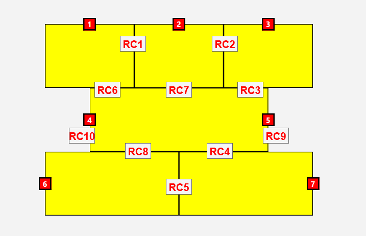

## Mapa de Trilhos e Recursos Compartilhados

Abaixo está a representação visual do servidor. As etiquetas com letras vermelhas indicam as **Regiões Críticas** (segmentos de trilho compartilhados), onde o acesso deve ser controlado via exclusão mútua (Semáforo) para evitar colisões.

### Tabela de Regiões Críticas

| ID (Mapa) | Trens Concorrentes |
| :---: | :--- |
| **RC1** | Trem 1 e Trem 2 |
| **RC2** | Trem 2 e Trem 3 |
| **RC3** | Trem 3, Trem 4 e Trem 5 |
| **RC4** | Trem 7, Trem 4 e Trem 5 |
| **RC5** | Trem 6 e Trem 7 |
| **RC6** | Trem 1, Trem 4 e Trem 5 |
| **RC7** | Trem 2, Trem 4 e Trem 5 |
| **RC8** | Trem 6, Trem 4 e Trem 5 |
| **RC9** | Trem 4 e Trem 5 |
| **RC10** | Trem 4 e Trem 5 |