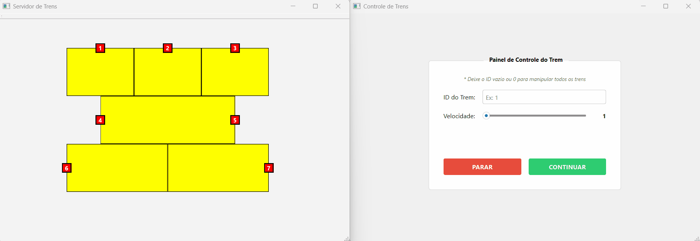

# Simulação de Controle de Tráfego de Trens



**Descrição:** Este projeto simula uma malha ferroviária com múltiplos trens operando simultaneamente. Desenvolvido como requisito da disciplina de Sistemas Operacionais, o foco principal é a aplicação prática de conceitos de Programação Concorrente.

**Principais Implementações:**

* Gerenciamento de Threads (uma para cada trem).
* Sincronização de processos via Semáforos.
* Tratamento de Regiões Críticas (interseções de trilhos).
* Interface gráfica interativa desenvolvida com Qt Creator.
* Comunicação Cliente-Servidor (TCP/IP) para controle remoto dos trens.

## Instalação e Execução

Este projeto foi desenvolvido utilizando o **Qt Creator (Community Edition)**. Para executar a simulação, recomenda-se o uso da mesma IDE para garantir a compatibilidade das bibliotecas.

### Pré-requisitos
* **Qt Creator**
* **Kit de Compilação C++**

### Como rodar o projeto

1.  Clone este repositório:
    ```bash
    git clone https://github.com/franciscopaulinoq/qt-train-controller.git
    ```
2.  Abra o **Qt Creator**.
3.  Vá em **File > Open File or Project** e selecione o arquivo `qt-train-controller.pro`.
4.  Configure o projeto utilizando o kit de compilação padrão detectado pelo Qt.
5.  **Importante (Arquitetura Cliente-Servidor):**
    * Este sistema possui dois módulos: **Servidor** (Exibe os trens em movimento e gerencia a concorrência) e **Cliente** (Controlador).
    * Certifique-se de executar o projeto do **Servidor** primeiro para iniciar a interface dos trilhos e servidor socket.
    * Em seguida, execute o projeto do **Cliente** para enviar os comandos.

### Ambientes Testados
* **Sistema Operacional:** Windows 11
* **Qt Version:** 6.10.0
  
## Mapa de Trilhos e Recursos Compartilhados

Abaixo está a representação visual do servidor. As etiquetas com letras vermelhas indicam as **Regiões Críticas** (segmentos de trilho compartilhados), onde o acesso deve ser controlado via exclusão mútua (Semáforo) para evitar colisões.


### Tabela de Regiões Críticas

| ID (Mapa) | Trens Concorrentes |
| :---: | :--- |
| **RC1** | Trem 1 e Trem 2 |
| **RC2** | Trem 2 e Trem 3 |
| **RC3** | Trem 3, Trem 4 e Trem 5 |
| **RC4** | Trem 7, Trem 4 e Trem 5 |
| **RC5** | Trem 6 e Trem 7 |
| **RC6** | Trem 1, Trem 4 e Trem 5 |
| **RC7** | Trem 2, Trem 4 e Trem 5 |
| **RC8** | Trem 6, Trem 4 e Trem 5 |
| **RC9** | Trem 4 e Trem 5 |
| **RC10** | Trem 4 e Trem 5 |